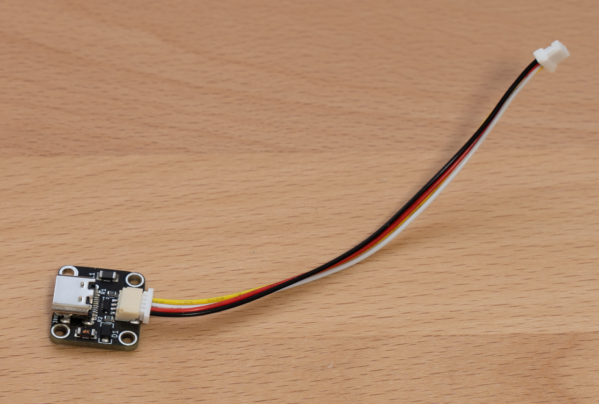
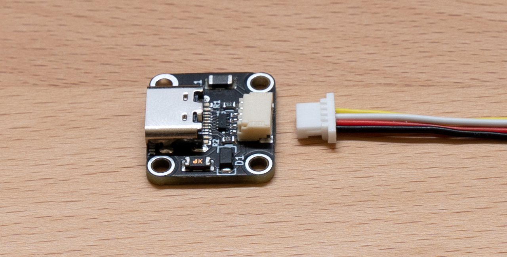
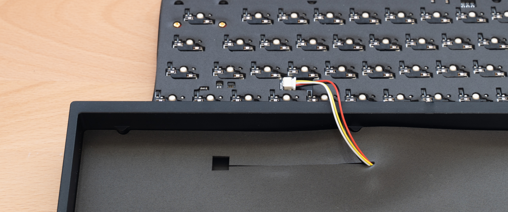
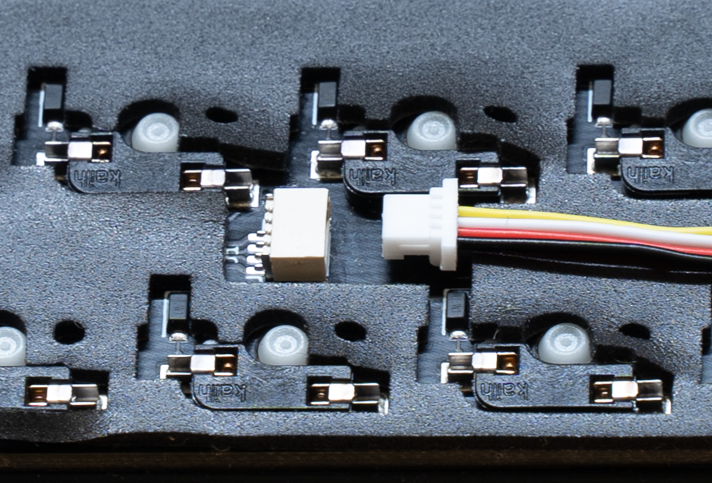
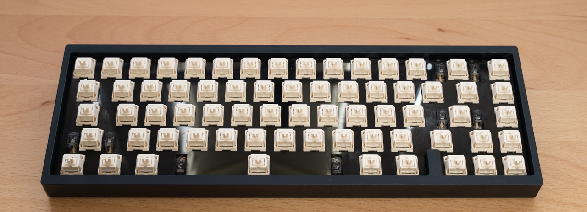
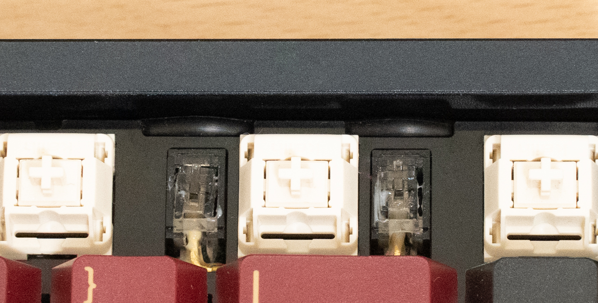
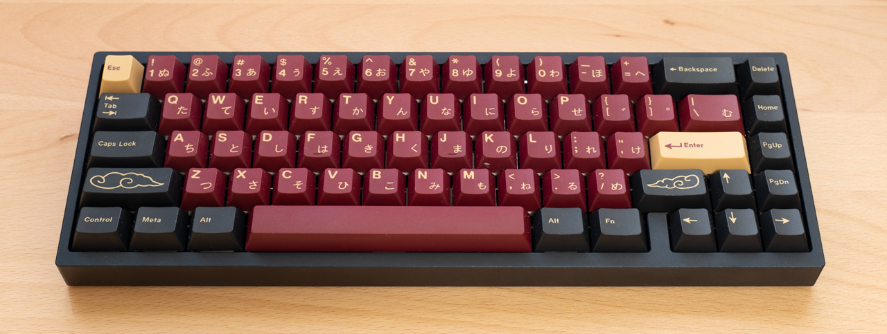
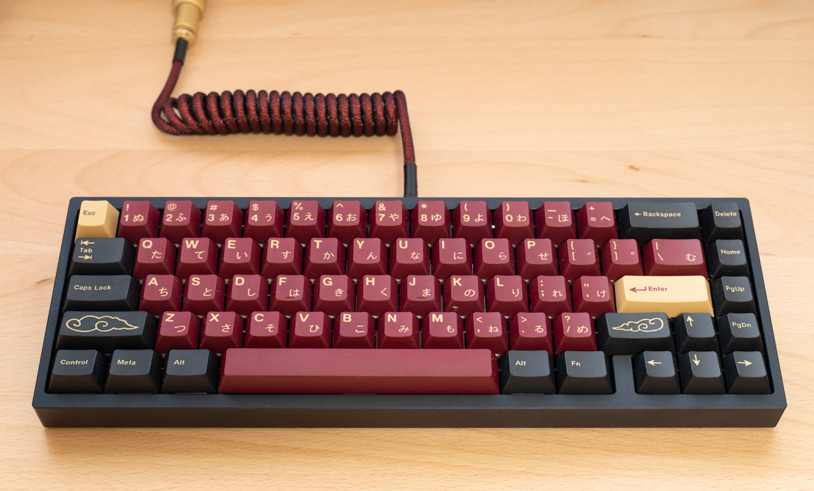
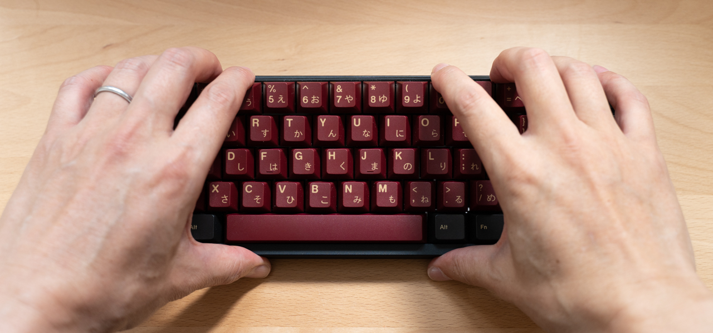

# Build Guide
Instructions for assembling Mikeneko65 kit are given below.

## Checking the contents of the kit
The parts included in the kit are listed below.  
If any parts are missing or damaged, please let us know before assembling.  

| No | Name | Spec | Quantity |
| ----- | ----- | ----- | ----- |
| 1 | Aluminum case | Aluminum | 1 |
| 2 | Main PCB | Hotswap socket compatible, 1.6 mm thick | 1 |
| 3 | Plate | Polycarbonate, 1.5mm thick | 1 |
| 4 | PCB foam | Poron, 3mm thick | 1 |
| 5 | Switch foam | Polyethylene or Poron, 0.5mm thick | 1 |
| 6 | Case foam | Poron, 1.5mm thick | 1 |
| 7 | Socket foam | Poron, 1.5mm thick | 1 |
| 8 | O-ring | AS568-264-VMQ-A30 | 1 |
| 9 | USB-C daughter board | [Unified Daughterboard C3](https://github.com/ai03-2725/Unified-Daughterboard) | 1 |
| 10 | JST cable | JST-SH, 4pin, double-side female connector, reverse direction, 10cm | 1 |
| 11 | Screws | m2 4mm, for USB-C daughter board | 4 |
| 12 | Rubber feet(Bumpons) | 3M SJ5302, diameter 8mm, height 2mm | 4 |

## Items to be prepared separately
Please prepare the following parts and tools separately from the kit  

### Parts
| Name | Spec | Quantity |
| ----- | ----- | ----- |
| Key switch | CherryMX compatible keyswitch, 5pins(recommended) | 67 |
| Keycap | CherryMX compatible keycap, 1.75U Shift key(required) | 67 |
| Stabilizer | Durock V2 etc | 6.25U 1set, 2U 3 set |
| USB cable | The connector on the keyboard side is USB-C | 1 |
| Grease for lubrication | Krytox 205g0(recommended) | several grams |

### Tools
| Name | Use | Necessity | Example |
| ----- | ----- | ----- | ----- |
| Phillips screwdriver (No.0) | Install the USB-C daughter board | Required | General purpose item |
| Key switch puller | Pull out the key switch | Almost required if replacing key switches | [Kbdfans Switch and Keycaps Puller](https://kbdfans.com/products/kbdfans-switch-and-keycaps-puller?variant=39615445827723) |
| Key switch opener | Disassemble the key switch | Almost required if lubricating key switches | [Gateron Switch Opener](https://kbdfans.com/products/gateron-switch-opener)   [KBDFANS x ai03 2in1 Aluminum Switch Opener](https://kbdfans.com/products/gb-2-in-1-machined-aluminum-switch-opener) |
| Keycap puller | Remove the keycap | Better to have it if replacing keycaps | [Kbdfans Switch and Keycaps Puller](https://kbdfans.com/products/kbdfans-switch-and-keycaps-puller?variant=39615445827723) |
| Longnose pliers | Adjust key switch pins | Required if adjusting pins | General purpose item |
| Round brush (No.0) | Lubricate key switches and stabilizers | Required if lubricating | [Kbdfans Lube Tools Collection](https://kbdfans.com/products/kbdfans-lube-tools-collection) |
| Stem holder | Grab a stem when lubricating the stem | Convenient to have | [Kbdfans Lube Tools Collection](https://kbdfans.com/products/kbdfans-lube-tools-collection) |
| Tweezers | Holding screws, etc | Convenient to have | [Kbdfans Lube Tools Collection](https://kbdfans.com/products/kbdfans-lube-tools-collection) |

## Assembly Instructions
1. **Attaching rubber feet**  
   
   First attach the rubber feet to the aluminum case so that the bottom of the aluminum case is not scratched.  
   Attach the rubber feet according to the engraved positions on the four corners of the back of the aluminum case.  
1. **Pasting socket foam**  
   
   Pasting socket foam is difficult and cannot be redone.  
   Show how to paste the entire surface and how to paste only a part of it.  
   
   **Practice**  
   First, practice several times without peeling off the release paper on the adhesive surface.  
   
   Place the socket foam on a flat surface with the adhesive surface facing up.  
   Straighten any bent or floating parts.  
   
   Hold the four corners with the back side (part mounting surface) of the main PCB facing down.  
   Looking at the main PCB from directly above, slowly align the notch of the mount post with the main PCB, put it on the foam.  

   **When pasting the entire surface**  
   Peel off the release paper on the adhesive surface of the socket foam, and paste the main PCB and socket foam according to the procedure you practiced.  
   It is recommended not to peel it off.  
   (even if it can be peeled off, the socket foam will stretch and the position will not match)  
   
   **When pasting only a part**  
   Peel off only a part of the release paper and paste it.  
   The area to peel off is about 10 square mm per place, and the place to peel off is about 7-8 places where the width is not narrow.  
   Cut a part with scissors and paste the main PCB and socket foam according to the procedure you practiced.

1. **スタビライザーの組み立て**  
   [こちら](https://www.youtube.com/watch?v=-vhpHjlkRgQ)のYouTube動画を参考にしてください  
   ステムの外側とハウジングの内側に厚めにグリスを塗ります  
   ハウジングにステムを挿し込みます  
   ワイヤーの先端から直角に曲がってる部分にかけてグリスを厚めに塗ります  
   ステムにワイヤーを挿し込み、ハウジングにワイヤーをはめ込みます  
1. **スタビライザーの取り付け**  
   
   先にネジ穴がない側をメインPCBのスタビライザー取り付け穴の大きい方に挿し込みます  
   次にネジ穴がある側をメインPCBの裏面からネジ止めします  
   スタビライザーのハウジングがメインPCBから浮いていなこと、ガタつきがないことを確認してください
1. **スイッチフォームの取り付け**  
   
   メインPCBの表面にスイッチフォームを乗せます  
   スタビライザー部分はスイッチフォームがスタビライザーのワイヤーの下にくるように滑り込ませます
1. **PCBフォームの取り付け**  
   
   スタビライザーの位置に合わせて、メインPCBの表面にPCBフォームを乗せます
1. **プレートの取り付け**
   
   キースイッチの穴に合わせて、PCBフォームの上にプレートを乗せます
1. **キースイッチのルブ(グリス塗布)**  
   必須ではありませんが、打鍵感と打鍵音を良くするためにルブすることを強くおすすめします  
   [こちら](https://www.youtube.com/watch?v=44Wv4OGdmu4)のYouTube動画が参考になります  
1. **キースイッチの取り付け**  
   
   スイッチフォームの穴とメインPCBのキースイッチのピンの穴の位置が合っていることを確認します  
   キースイッチのピンが真っすぐになっていることを確認し、プレートの上からキースイッチをメインPCBに挿し込みます  
   (斜めに挿し込むと、ピンが折れたり、ソケットが破損することがあるので注意してください)  
   側面から見て、プレートとキースイッチ、キースイッチとメインPCBの間にすき間がなく、均一に取り付けられていることを確認してください
1. **Oリングの取り付け**  
   メインPCBとプレートの間にOリングを取り付けます  
   
   バックスペースキーの奥側とスペースバーの手前側のスタビライザーは、プレートの切り欠きに合わせてOリングをスタビライザーの上面に通します  
   Oリングがスタビライザーの上面に固定できない場合は、メインPCBをケースに取り付ける際に調整できるので、いったんそのまま進めてください  
   側面から見て、メインPCBとOリングとプレートの間に隙間がないことを確認してください
1. **JSTケーブルをUSB-Cドーターボードに接続**  
   
   JSTケーブルをUSB-Cドーターボードに接続します  
   
   JSTケーブルのコネクタは裏表があるので、写真を参考にして端子が露出していない面を上側にして挿します  
1. **USB-Cドーターボードの取り付け**  
   
   USB-Cドーターボードの表面(部品が実装されている面)を上側にして、アルミケースの中央奥にm2 4mmのネジでネジ止めします  
   ピンセットでネジを掴むとネジ止めしやすくなります
1. **ケースフォームの取り付け**  
   
   アルミケースの内側のポストとケースフォームの切り欠きの位置を合わせて、アルミケースの内側にケースフォームを敷きます  
   JSTケーブルをケースフォームの切り込みから引き出しておきます
1. **JSTケーブルをメインPCBに接続**  
   
   メインPCBの裏面にあるJSTコネクタ(ベージュ色)にJSTケーブルのコネクタを挿します  
   
   JSTケーブルのコネクタは裏表があるので、写真を参考にして端子が露出していない面を上側にして挿します  
1. **メインPCBをケースに取り付け**  
   
   メインPCBの奥側を少し持ち上げた状態で、アルミケースのブロッカーにメインPCBのブロッカー部分とOリングの間を通します  
   メインPCB全体を少し持ち上げ、メインPCBの手前側のOリングをアルミケースの手前側のポストの上に乗せます(目視はできません)  
   メインPCBの奥側のOリングがアルミケースの奥側のポストに軽く当たるまでゆっくり下に押し込みます(目視はできません)  
   
   Oリングが巻き上がってプレートの表面に出てきていないことを確認してください
1. **キーキャップの取り付け**  
   
   キースイッチにキーキャップを取り付けます
1. **USBケーブルの接続**  
   
   お手持ちのUSBケーブルをキーボードとPCに接続して完成です  

## アルミケースからメインPCBを取り外す手順
- **手で取り外す**  
  
  キーキャップを取り付けた状態で、最上段の8つのキーキャップに指を掛けてゆっくり上に持ち上げます  
  固い場合は無理をせず、下記のキーキャッププラーを使う方法で取り外してください  
- **キーキャッププラーで取り外す**  
  
  1キー、2キー、-キー、=キーのキーキャップを外し、プレートの切り欠きにキースイッチプラーを引っ掛けて、左右交互に少しずつ持ち上げます  
  
  メインPCBがアルミケースから外れたら、メインPCBを少し持ち上げて、メインPCB側のコネクタからJSTケーブルを外します  
  ※ JSTケーブルを外さないままメインPCBを一気に持ち上げると、コネクタが破損したりJSTケーブルが断線するので注意してください

## ご注意
- JSTケーブルとJSTコネクタはまっすぐに挿し、ゆっくりと奥まで押し込んでください  
  斜めに挿したまま押し込むとコネクタが破損することがあります
- プレートのバックスペースキーの上の部分が細く、折れやすくなっていますので、無理な力を掛けないようにしてください
- キースイッチの取り付けと取り外しを繰り返すと、キースイッチのピンとソケットの接触が悪くなることがあります  
  接触が悪くなった場合は、ラジオペンチなどでキースイッチのピンを水平方向に少し(20度ぐらい)ねじってみてください
