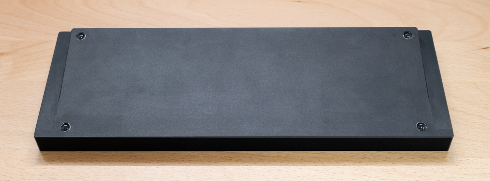
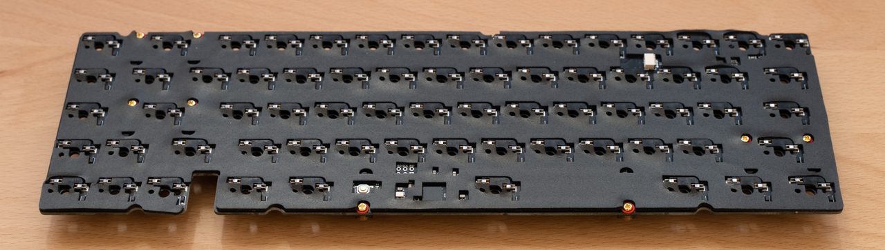
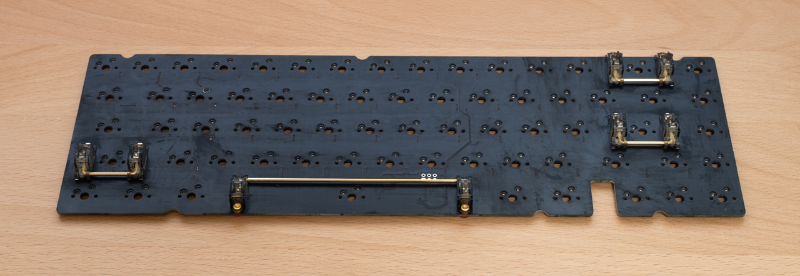
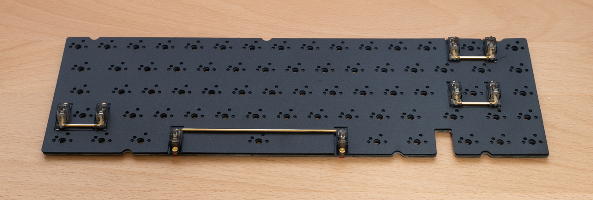
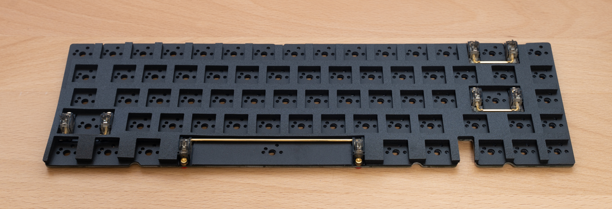
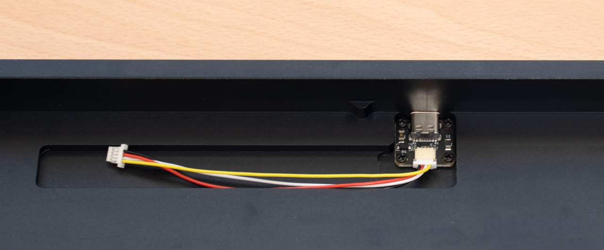
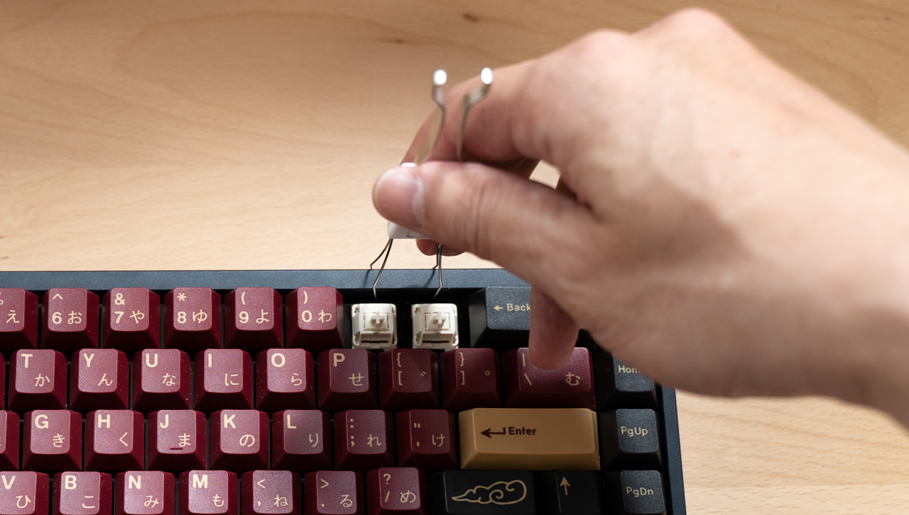

# Build Guide
Instructions for assembling Mikeneko65 kit are given below.

## Checking the contents of the kit
The parts included in the kit are listed below.  
If any parts are missing or damaged, please let us know before assembling.  

| No | Name | Spec | Quantity |
| ----- | ----- | ----- | ----- |
| 1 | Aluminum case | Aluminum | 1 |
| 2 | Main PCB | Hotswap socket compatible, 1.6 mm thick | 1 |
| 3 | Plate | Polycarbonate, 1.5mm thick | 1 |
| 4 | PCB foam | Poron, 3mm thick | 1 |
| 5 | Switch foam | Polyethylene or Poron, 0.5mm thick | 1 |
| 6 | Case foam | Poron, 1.5mm thick | 1 |
| 7 | Socket foam | Poron, 1.5mm thick | 1 |
| 8 | O-ring | AS568-264-VMQ-A30 | 1 |
| 9 | USB-C daughter board | [Unified Daughterboard C3](https://github.com/ai03-2725/Unified-Daughterboard) | 1 |
| 10 | JST cable | JST-SH, 4pin, double-side female connector, reverse direction, 10cm | 1 |
| 11 | Screws | m2 4mm, for USB-C daughter board | 4 |
| 12 | Rubber feet(Bumpons) | 3M SJ5302, diameter 8mm, height 2mm | 4 |

## Items to be prepared separately
Please prepare the following parts and tools separately from the kit  

### Parts
| Name | Spec | Quantity |
| ----- | ----- | ----- |
| Key switch | CherryMX compatible key switch, 5pins(recommended) | 67 |
| Keycap | CherryMX compatible keycap, 1.75U Shift key(required) | 67 |
| Stabilizer | Durock V2, etc | 6.25U * 1set and 2U * 3set |
| USB cable | The connector on the keyboard side must be USB-C | 1 |
| Grease for lubrication | Krytox 205g0(recommended) | a few grams |

### Tools
| Name | Use | Necessity | Example |
| ----- | ----- | ----- | ----- |
| Phillips screwdriver (No.0) | Install USB-C daughter board | Required | General purpose item |
| Key switch puller | Pull out key switch | Almost required if replacing key switches | [Kbdfans Switch and Keycaps Puller](https://kbdfans.com/products/kbdfans-switch-and-keycaps-puller?variant=39615445827723) |
| Key switch opener | Disassemble key switch | Almost required if lubricating key switches | [Gateron Switch Opener](https://kbdfans.com/products/gateron-switch-opener)   [KBDFANS x ai03 2in1 Aluminum Switch Opener](https://kbdfans.com/products/gb-2-in-1-machined-aluminum-switch-opener) |
| Keycap puller | Remove keycap | Better to have it if replacing keycaps | [Kbdfans Switch and Keycaps Puller](https://kbdfans.com/products/kbdfans-switch-and-keycaps-puller?variant=39615445827723) |
| Longnose pliers | Adjust key switch pins | Required if adjusting pins | General purpose item |
| Round brush (No.0) | Lubricate key switches and stabilizers | Required if lubricating | [Kbdfans Lube Tools Collection](https://kbdfans.com/products/kbdfans-lube-tools-collection) |
| Stem holder | Grab stem when lubricating it | Convenient to have | [Kbdfans Lube Tools Collection](https://kbdfans.com/products/kbdfans-lube-tools-collection) |
| Tweezers | Holding screws, etc | Convenient to have | [Kbdfans Lube Tools Collection](https://kbdfans.com/products/kbdfans-lube-tools-collection) |

## Assembly Instructions
1. **Attaching rubber feet**  
   
   First attach the rubber feet to the aluminum case so that the bottom of the aluminum case is not scratched.  
   Attach the rubber feet according to the engraved circle on the four corners of the back of the aluminum case.  

1. **Pasting socket foam**  
   
   Pasting socket foam is difficult and cannot be redone.  
   There are two methods: one is to paste the entire surface and the other is to paste only a portion of the surface.  
   
   **Practice**  
   First, practice several times without peeling off the release paper on the adhesive surface.  
   
   Place the socket foam on a flat surface with the adhesive surface facing up.  
   Straighten any bent or floating parts.  
   
   Hold the four corners with the back side (part mounting surface) of the main PCB facing down.  
   Look at the main PCB from directly above, align the notch of the mount post with the main PCB, slowly put it on the foam.  

   **When pasting the entire surface**  
   Peel off the release paper on the socket foam, and paste the main PCB and socket foam according to the procedure you practiced.  
   Once pasted, it cannot be removed cleanly, so recommend not removing it, even if it is slightly displaced.  
   (even if it can be removed, the socket foam will be stretched and the position will not match)  
   
   **When pasting only a part**  
   Peel off only a part of the release paper and paste it.  
   The area to peel off is about 10 square mm per place, and the place to peel off is about 7-8 places where the width is not narrow.  
   Cut a part of the release paper with scissors and paste the main PCB and socket foam according to the procedure you practiced.

1. **Assembling the stabilizers**  
   Please refer to [this YouTube video](https://www.youtube.com/watch?v=-vhpHjlkRgQ).  
   Apply a little thick grease to the outside of the stem and the inside of the housing.  
   Insert the stem into the housing.  
   Apply a little thick grease from the tip of the wire to the part that bends at a right angle.  
   Insert the wire into the stem and fit the wire into the housing.  

1. **Installing stabilizers**  
   
   First, insert the side without screw holes into the larger stabilizer mounting holes on the main PCB.  
   Next, screw the side with screw holes from the back side of the main PCB.  
   Make sure that the stabilizer housing is not lifted off the main PCB and that there is no rattling.  

1. **Placing switch foam**  
   
   Place the switch foam on the main PCB.  
   Slide the switch foam so that it is under the stabilizer wires.  

1. **Placing PCB foam**  
   
   Place PCB foam on the main PCB in line with the stabilizer position.  

1. **Placing plate**
   
   Place the plate on the PCB foam, aligning it with the hole in the key switches.  

1. **Lubricating key switches**  
   Although not required, it is highly recommended to lubricate the key switches to improve the typing feels and sounds.  
   Please refer to [this YouTube video](https://www.youtube.com/watch?v=44Wv4OGdmu4).  

1. **Installing key switches**  
   
   Check that the holes in the switch foam align with the key switch pin holes on the main PCB.  
   Check that the pins of the key switch are straight and insert the key switch into the main PCB from the top of the plate.  
   (Be careful not to insert at an angle, as this may break the pins or damage the sockets)  
   Make sure that there are no gaps between the plate and the key switches, and between the key switches and the main PCB, viewed from the side, and that they are evenly installed.  

1. **Installing O-ring**  
   Install O-ring between main PCB and plate.  
   
   
   Around the backspace and spacebar keys, pass the O-ring through the top surface of the stabilizer, aligning it with the notch in the plate.  
   If the O-ring cannot be secured to the top of the stabilizer, proceed as is once it is in place, as it can be adjusted when the main PCB is installed in the case.  
   Make sure there is no gap and bend between the main PCB, O-ring and plate when viewed from the side.  

1. **Connecting JST cable to USB-C daughter board**  
   
   Connect JST cable to USB-C daughter board.  
   
   Since JST cable connectors have front and back sides, refer to the photo and insert the connector with the side with no exposed terminals facing up.    

1. **Installing USB-C daughter board**  
   
   With the surface of the USB-C daughter board (the side where the components are mounted) facing up, screw it into the center back of the aluminum case with four m2 4mm screws.  
   Grab the screws with tweezers to make it easier to screw them in.  

1. **Installing case foam**  
   
   Align the posts inside the aluminum case with the notches in the case foam, and put the case foam inside the aluminum case.    
   Pull the JST cable through the cutout in the case foam.  

1. **Connecting JST cable tom main PCB**  
   
   Insert the JST cable connector into the JST connector (beige color) on the back of the main PCB.  
   
   Since JST cable connectors have front and back sides, refer to the photo and insert the connector with the side with no exposed terminals facing up.    

1. **Installing main PCB to aluminum case**  
   
   With the back side of the main PCB slightly raised, pass the blocker of the aluminum case between the blocker of the main PCB and the O-ring.    
   Lift the entire main PCB slightly and put the O-ring on the front side of the main PCB over the post on the front side of the aluminum case (not visible).  
   Gently push the main PCB down until the O-ring lightly touches the post on the aluminum case (not visible).  
   
   Make sure the O-ring is not rolled up and coming out of  the plate.  

1. **Installing keycaps**  
   
   Installing the keycaps to the key switches.  

1. **Connecting USB cable**  
   
   Connect your USB cable to the keyboard and PC and now it is completed.  

## Procedure for removing the main PCB from the aluminum case
- **Removing it by hand**  
  
  With the keycaps are installed, hook your fingers on the top eight keycaps and slowly lift them upward.  
  If it is hard, do not force and pull up, use the keycap puller as described below.  
- **Removing main PCB by keycap puller**  
  
  Remove the keycaps of the '1' & '2' & '-' & '=' keys, hook the key switch puller into the notch in the plate and lift it slightly, alternating left and right.  
  Once the main PCB is off the aluminum case, lift the main PCB slightly and disconnect the JST cable from the connector on the main PCB.  
  * Be careful not to lift the main PCB all at once without disconnecting the JST cable, since the connector will be damaged and the JST cable will be cut.  

## Cautions
- Insert the JST cable and JST connector straight and push it in slowly and deeply.    
  The connector may be damaged if it is pushed in while inserted at an angle.  
- The upper part of the backspace key on the plate is thin and easily broken, so do not apply excessive force.
- Repeated installation and removal of the key switches may result in poor contact between the key switch pins and the socket.  
  If contact becomes poor, try twisting the key switch pins slightly (about 20 degrees) horizontally with longnose pliers or something.
