# ビルドガイド
Mikeneko65のキットの組み立て手順を説明します

## キットの内容の確認
キットに含まれるパーツは下記のとおりです  
欠品や破損がある場合、組み立てる前にお知らせください  

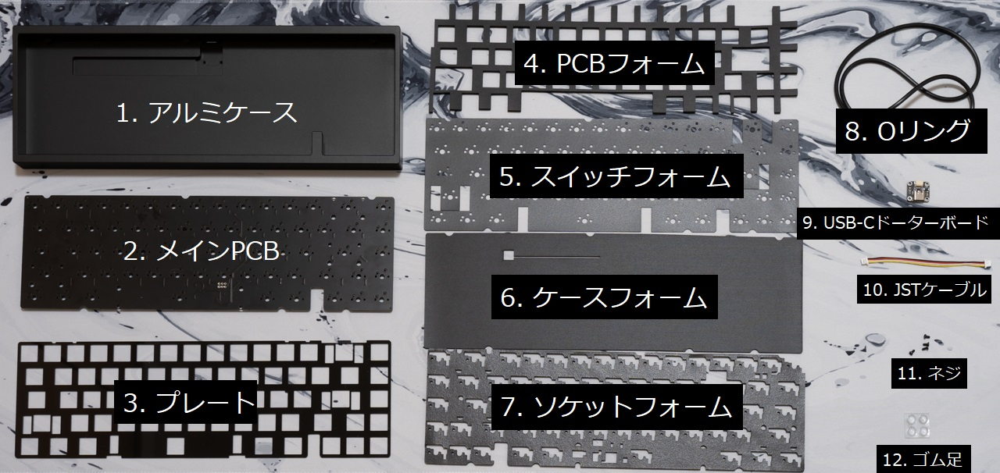

| No | パーツ | 仕様 | 数量 |
| ----- | ----- | ----- | ----- |
| 1 | アルミケース | アルミニウム | 1個 |
| 2 | メインPCB | ホットスワップソケット対応、1.6mm厚 | 1枚 |
| 3 | プレート | ポリカーボネート、1.5mm厚 | 1枚 |
| 4 | PCBフォーム | ポロン、3mm厚 | 1枚 |
| 5 | スイッチフォーム | ポリエチレン or ポロン、0.5mm厚 | 1枚 |
| 6 | ケースフォーム | ポロン、1.5mm厚 | 1枚 |
| 7 | ソケットフォーム | ポロン、1.5mm厚 | 1枚 |
| 8 | Oリング | AS568-264-VMQ-A30 | 1本 |
| 9 | USB-Cドーターボード | [Unified Daughterboard C3](https://github.com/ai03-2725/Unified-Daughterboard) | 1枚 |
| 10 | JSTケーブル | JST-SH、4pin、両端メスコネクタ、逆方向タイプ、10cm | 1本 |
| 11 | ネジ | m2 4mm、USB-Cドーターボード取り付け用 | 4本 |
| 12 | ゴム足 | 3M SJ5302、直径8mm、高さ2mm | 4個 |

## 別途用意するもの
キットとは別に下記のパーツや工具を用意してください

### パーツ
| パーツ | 仕様 | 数量 |
| ----- | ----- | ----- |
| キースイッチ | CherryMX互換キースイッチ、5ピン推奨 | 67個 |
| キーキャップ | CherryMX互換キーキャップ、要1.75U Shiftキー | 67個 |
| スタビライザー | Durock V2など | 6.25U 1セット、2U 3セット |
| USBケーブル | キーボード側のコネクタはUSB-C | 1本 |
| ルブ用グリス | Krytox 205g0推奨 | 適量 |

### 工具
| 工具 | 用途 | 必要性 | 製品例 |
| ----- | ----- | ----- | ----- |
| プラスドライバー(No.0サイズ) | USB-Cドーターボードを取り付ける | 必須 | 汎用品でOK |
| キースイッチプラー | キースイッチを引き抜く | キースイッチを交換するならほぼ必須 | [Kbdfans Switch and Keycaps Puller](https://kbdfans.com/products/kbdfans-switch-and-keycaps-puller?variant=39615445827723) |
| キースイッチオープナー | キースイッチを分解する | キースイッチをルブするならほぼ必須 | [Gateron Switch Opener](https://kbdfans.com/products/gateron-switch-opener)   [KBDFANS x ai03 2in1 Aluminum Switch Opener](https://kbdfans.com/products/gb-2-in-1-machined-aluminum-switch-opener) |
| キーキャッププラー | キーキャップを取り外す | キーキャップを交換するならあったほうがいい | [Kbdfans Switch and Keycaps Puller](https://kbdfans.com/products/kbdfans-switch-and-keycaps-puller?variant=39615445827723) |
| ラジオペンチ | キースイッチのピンを調整する | ピンを調整するなら必須 | 汎用品でOK |
| 丸筆(0号) | キースイッチやスタビライザーをルブする | ルブするなら必須 | [Kbdfans Lube Tools Collection](https://kbdfans.com/products/kbdfans-lube-tools-collection) |
| ステムホルダー | ステムにルブする際にステムを掴む | あると便利 | [Kbdfans Lube Tools Collection](https://kbdfans.com/products/kbdfans-lube-tools-collection) |
| ピンセット | ネジの保持など | あると便利 | [Kbdfans Lube Tools Collection](https://kbdfans.com/products/kbdfans-lube-tools-collection) |

## 組み立て手順
1. **ゴム足の貼り付け**  
   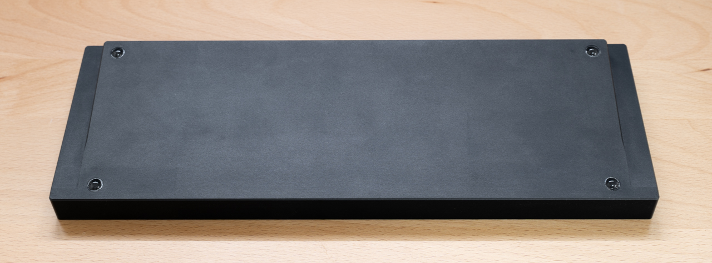
   アルミケースの底面が傷付かないように、最初にアルミケースにゴム足を取り付けておきます  
   アルミケースの裏面の四隅の彫り込み位置に合わせてゴム足を取り付けます
1. **ソケットフォームの貼り付け**  
   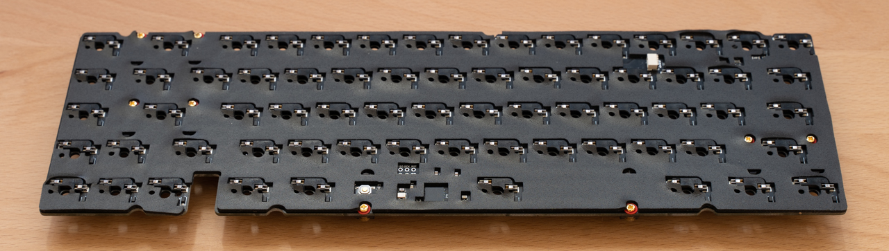
   ソケットフォームの貼り付けは難易度が高くやり直しが効きません  
   全面を貼り付ける方法と一部分だけを貼り付ける方法を紹介します  
   
   **全面を貼り付ける場合**  
   最初は接着面の剥離紙を剥がさずに何度か練習してください  
   ソケットフォームの接着面を上に向けて、平らな場所に置きます  
   曲がったり浮いたりしている箇所があればまっすぐになるように修正してください  
   メインPCBの裏面(パーツ実装面)を下に向けて、4つの角を人差し指と親指で持ちます  
   メインPCBを真上から見て、マウントポストの切り欠きの位置を合わせながらゆっくりとメインPCBをソケットフォームに乗せます  
   ここまでの手順を何度か練習してください  
   ソケットフォームの接着面の剥離紙を剥がし、練習した手順でメインPCBとソケットフォームを貼り付けます  
   一度貼り付くときれいに剥がせませんので、多少ずれても動作に支障がなければ無理に剥がさないことをおすすめします  
   (仮に何とか剥がれてもソケットフォームが伸びてしまい、位置が合わなくなります)  
   
   **一部分だけ貼り付ける場合**  
   剥離紙の一部だけを剥がして貼り付けます  
   剥がす面積は1箇所あたり10平方mm以下、剥がす箇所は幅が細くない場所を7-8箇所程度でいいと思います  
   剥離紙の一部を剥がした後にソケットフォームを貼り付ける手順は全面を貼り付ける場合と同様です  
1. **スタビライザーの組み立て**  
   [こちら](https://www.youtube.com/watch?v=-vhpHjlkRgQ)のYouTube動画を参考にしてください  
   ステムの外側とハウジングの内側に厚めにグリスを塗ります  
   ハウジングにステムを挿し込みます  
   ワイヤーの先端から直角に曲がってる部分にかけてグリスを厚めに塗ります  
   ステムにワイヤーを挿し込み、ハウジングにワイヤーをはめ込みます  
1. **スタビライザーの取り付け**  
   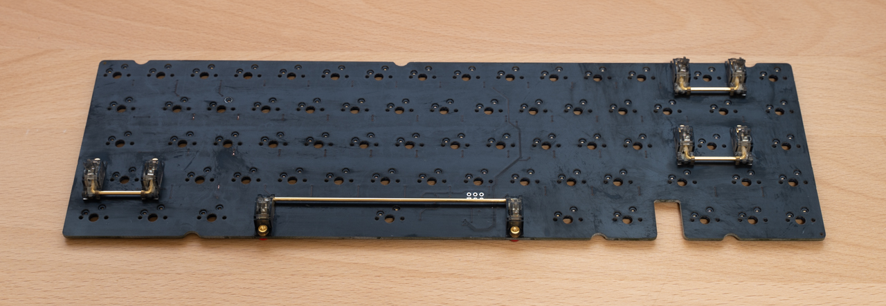
   先にネジ穴がない側をメインPCBのスタビライザー取り付け穴の大きい方に挿し込みます  
   次にネジ穴がある側をメインPCBの裏面からネジ止めします  
   スタビライザーのハウジングがメインPCBから浮いていなこと、ガタつきがないことを確認してください
1. **スイッチフォームの取り付け**  
   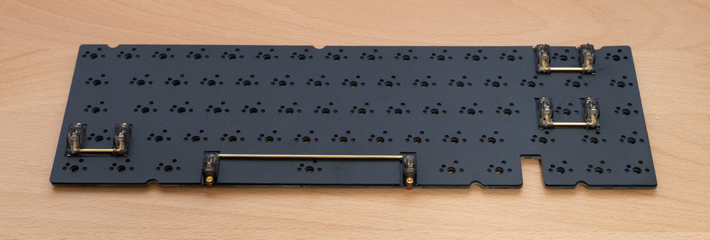
   メインPCBの表面にスイッチフォームを乗せます  
   スタビライザー部分はスイッチフォームがスタビライザーのワイヤーの下にくるように滑り込ませます
1. **PCBフォームの取り付け**  
   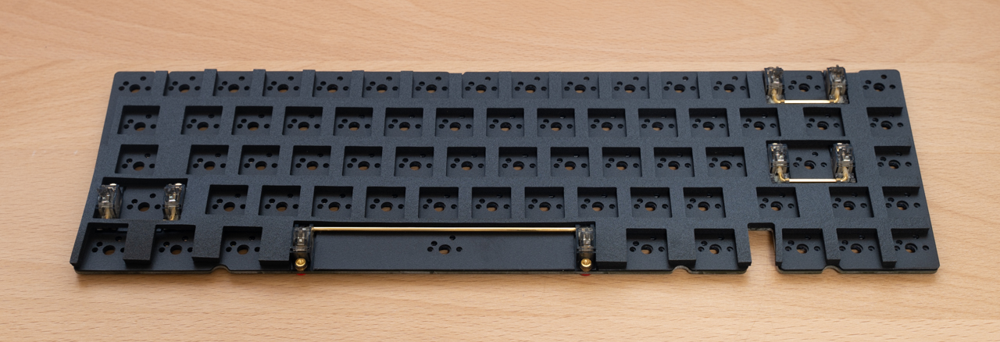
   スタビライザーの位置に合わせて、メインPCBの表面にPCBフォームを乗せます
1. **プレートの取り付け**
   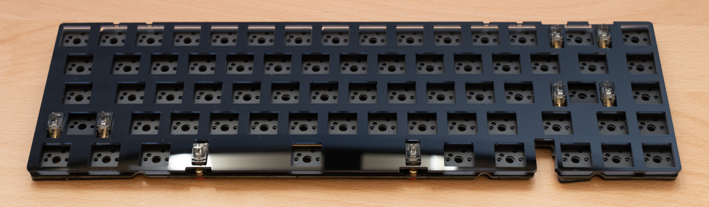
   キースイッチの穴に合わせて、PCBフォームの上にプレートを乗せます
1. **キースイッチのルブ(グリス塗布)**  
   必須ではありませんが、打鍵感と打鍵音を良くするためにルブすることを強くおすすめします  
   [こちら](https://www.youtube.com/watch?v=44Wv4OGdmu4)のYouTube動画が参考になります  
1. **キースイッチの取り付け**  
   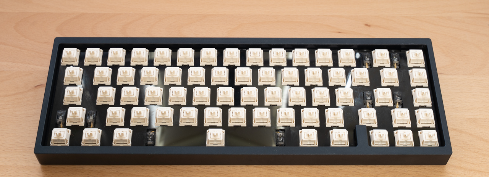
   スイッチフォームの穴とメインPCBのキースイッチのピンの穴の位置が合っていることを確認します  
   キースイッチのピンが真っすぐになっていることを確認し、プレートの上からキースイッチをメインPCBに挿し込みます  
   (斜めに挿し込むと、ピンが折れたり、ソケットが破損することがあるので注意してください)  
   側面から見て、プレートとキースイッチ、キースイッチとメインPCBの間にすき間がなく、均一に取り付けられていることを確認してください
1. **Oリングの取り付け**  
   メインPCBとプレートの間にOリングを取り付けます  
   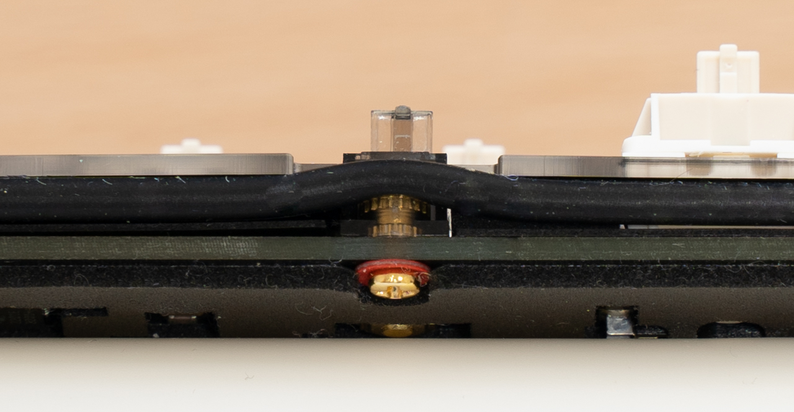
   バックスペースキーの奥側とスペースバーの手前側のスタビライザーは、プレートの切り欠きに合わせてOリングをスタビライザーの上面に通します  
   Oリングがスタビライザーの上面に固定できない場合は、メインPCBをケースに取り付ける際に調整できるので、いったんそのまま進めてください  
   側面から見て、メインPCBとOリングとプレートの間に隙間がないことを確認してください
1. **JSTケーブルをUSB-Cドーターボードに接続**  
   
   JSTケーブルをUSB-Cドーターボードに接続します  
   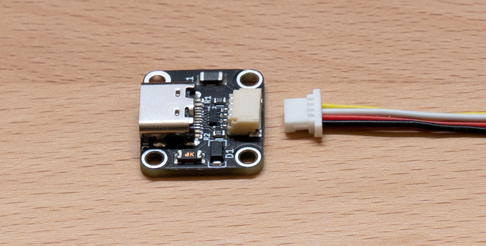
   JSTケーブルのコネクタは裏表があるので、写真を参考にして端子が露出していない面を上側にして挿します  
1. **USB-Cドーターボードの取り付け**  
   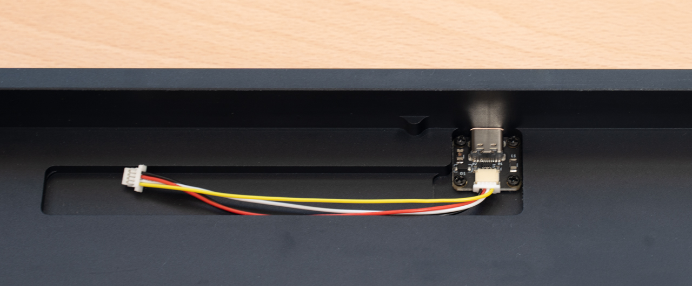
   USB-Cドーターボードの表面(部品が実装されている面)を上側にして、アルミケースの中央奥にm2 4mmのネジでネジ止めします  
   ピンセットでネジを掴むとネジ止めしやすくなります
1. **ケースフォームの取り付け**  
   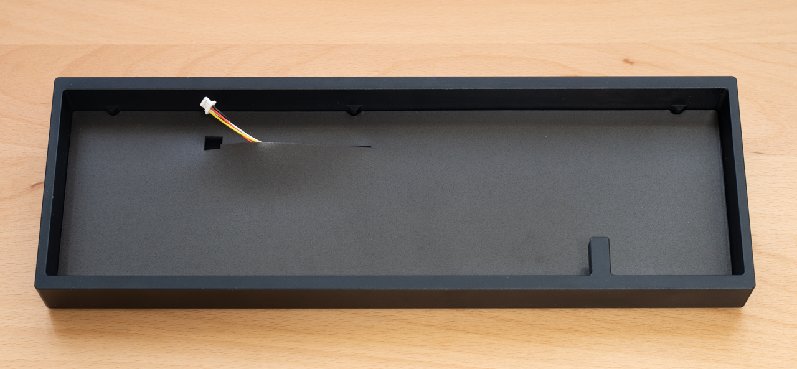
   アルミケースの内側のポストとケースフォームの切り欠きの位置を合わせて、アルミケースの内側にケースフォームを敷きます  
   JSTケーブルをケースフォームの切り込みから引き出しておきます
1. **JSTケーブルをメインPCBに接続**  
   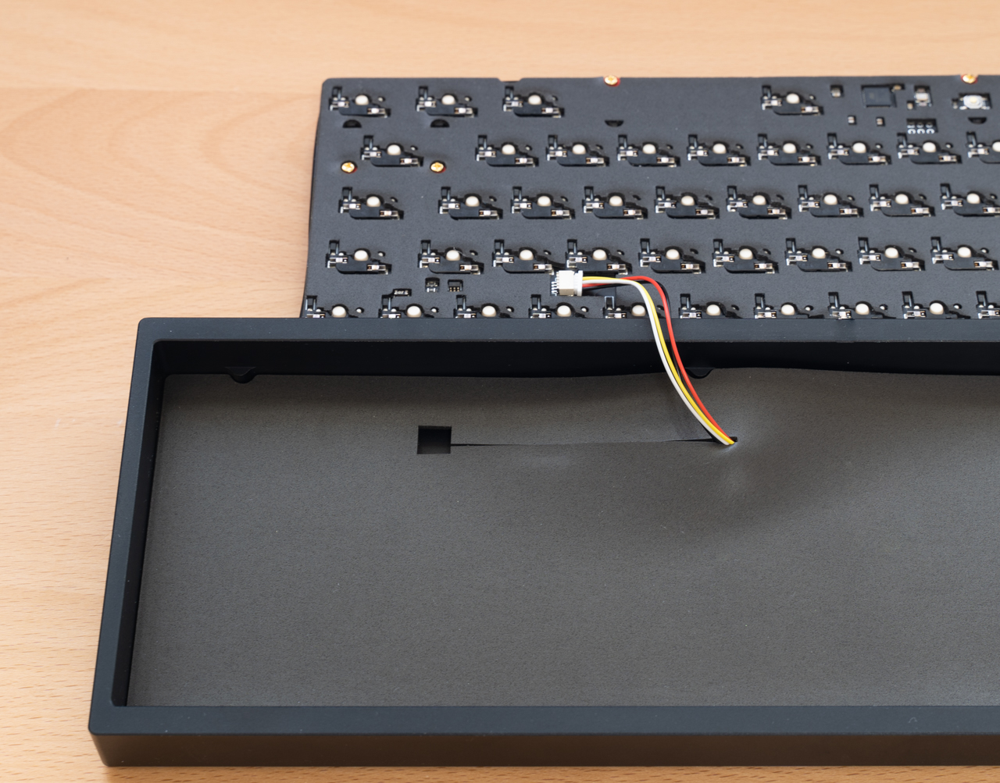
   メインPCBの裏面にあるJSTコネクタ(ベージュ色)にJSTケーブルのコネクタを挿します  
   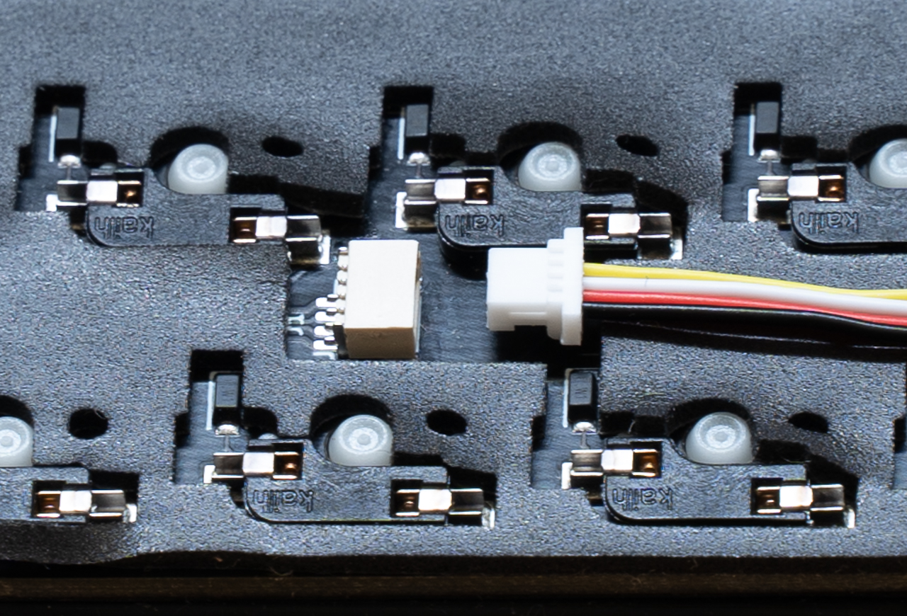
   JSTケーブルのコネクタは裏表があるので、写真を参考にして端子が露出していない面を上側にして挿します  
1. **メインPCBをケースに取り付け**  
   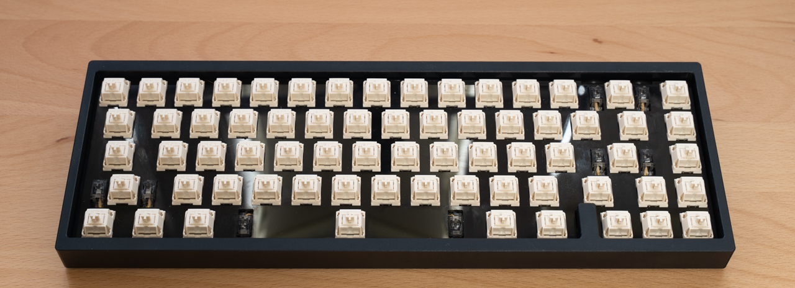
   メインPCBの奥側を少し持ち上げた状態で、アルミケースのブロッカーにメインPCBのブロッカー部分とOリングの間を通します  
   メインPCB全体を少し持ち上げ、メインPCBの手前側のOリングをアルミケースの手前側のポストの上に乗せます(目視はできません)  
   メインPCBの奥側のOリングがアルミケースの奥側のポストに軽く当たるまでゆっくり下に押し込みます(目視はできません)  
   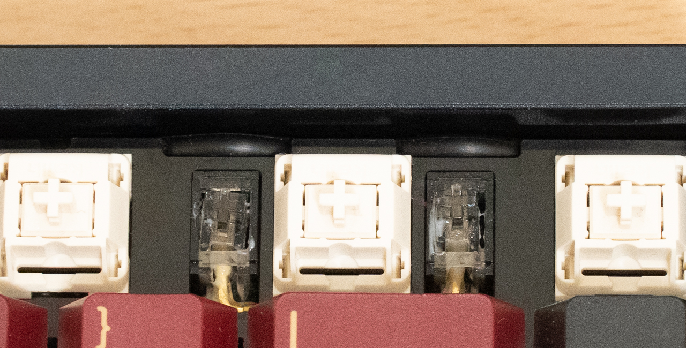
   Oリングが巻き上がってプレートの表面に出てきていないことを確認してください
1. **キーキャップの取り付け**  
   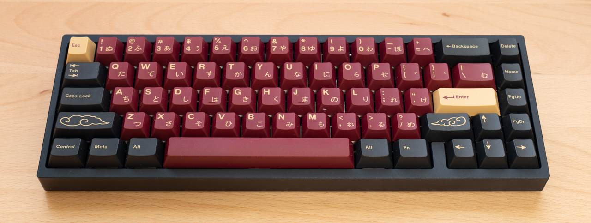
   キースイッチにキーキャップを取り付けます
1. **USBケーブルの接続**  
   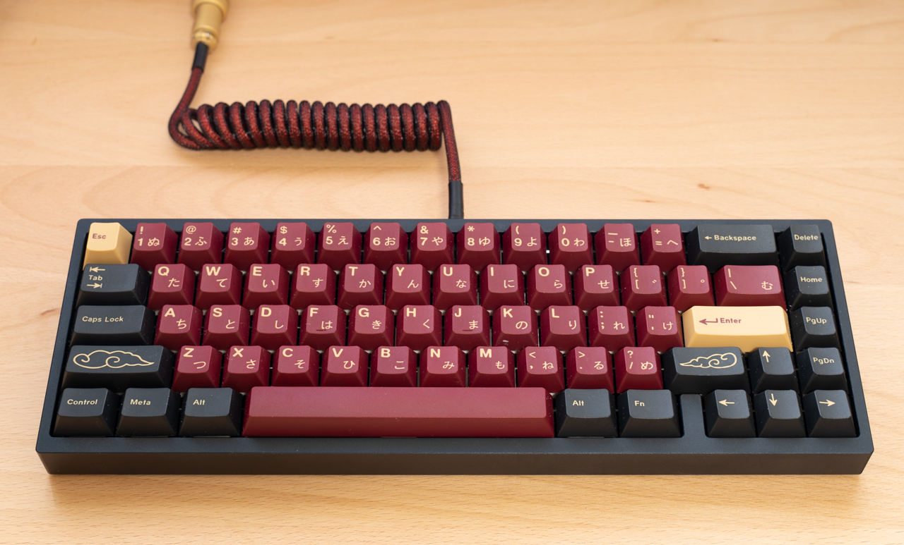
   お手持ちのUSBケーブルをキーボードとPCに接続して完成です  

## アルミケースからメインPCBを取り外す手順
- **手で取り外す**  
  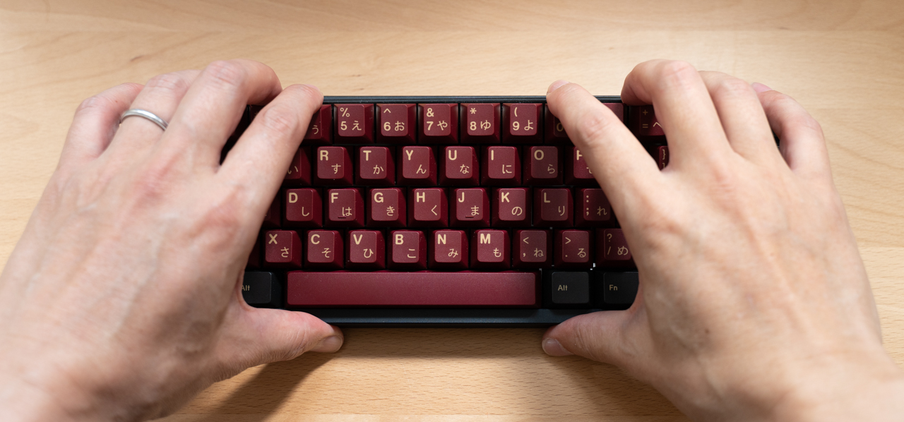
  キーキャップを取り付けた状態で、最上段の8つのキーキャップに指を掛けてゆっくり上に持ち上げます  
  固い場合は無理をせず、下記のキーキャッププラーを使う方法で取り外してください  
- **キーキャッププラーで取り外す**  
  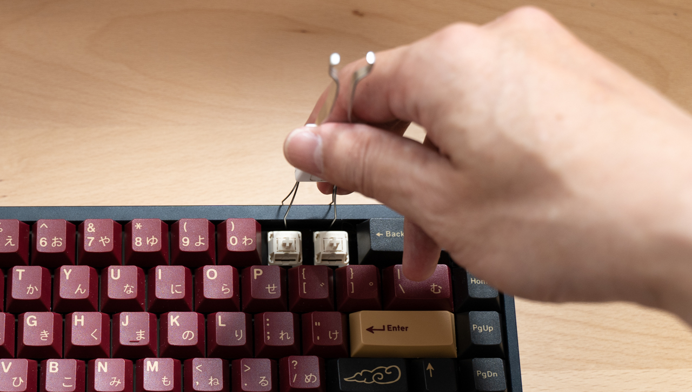
  1キー、2キー、-キー、=キーのキーキャップを外し、プレートの切り欠きにキースイッチプラーを引っ掛けて、左右交互に少しずつ持ち上げます  
  
  メインPCBがアルミケースから外れたら、メインPCBを少し持ち上げて、メインPCB側のコネクタからJSTケーブルを外します  
  ※ JSTケーブルを外さないままメインPCBを一気に持ち上げると、コネクタが破損したりJSTケーブルが断線するので注意してください

## ご注意
- JSTケーブルとJSTコネクタはまっすぐに挿し、ゆっくりと奥まで押し込んでください  
  斜めに挿したまま押し込むとコネクタが破損することがあります
- プレートのバックスペースキーの上の部分が細く、折れやすくなっていますので、無理な力を掛けないようにしてください
- キースイッチの取り付けと取り外しを繰り返すと、キースイッチのピンとソケットの接触が悪くなることがあります  
  接触が悪くなった場合は、ラジオペンチなどでキースイッチのピンを水平方向に少し(20度ぐらい)ねじってみてください
