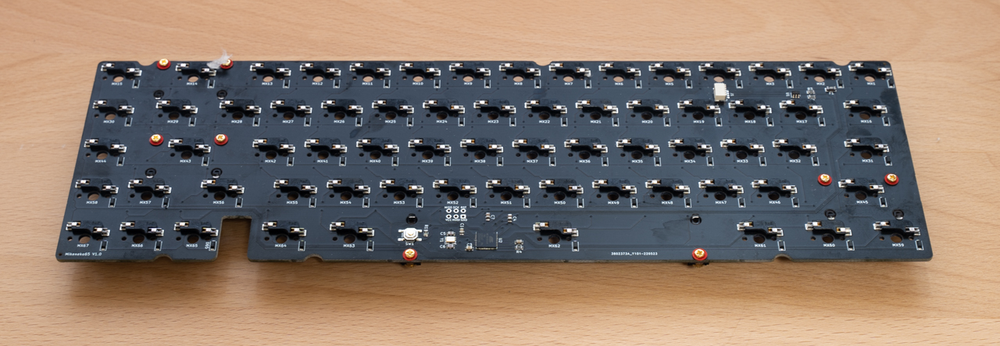
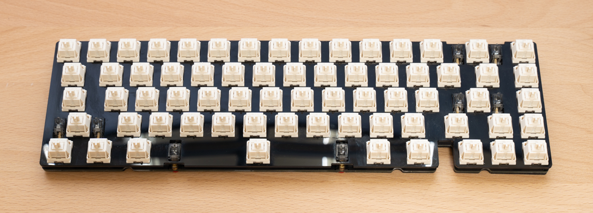

# ビルドガイド
Mikeneko65のキットの組み立て手順を説明します。

## キットの内容の確認
キットに含まれるパーツは下記のとおりです。欠品がないか確認してください。

| パーツ | 仕様 | 数量 |
| ----- | ----- | ----- |
| アルミケース | アルミニウム | 1個 |
| メインPCB | ホットスワップ対応、1.6mm厚 | 1枚 |
| プレート | ポリカーボネイト、1.5mm厚 | 1枚 |
| PCBフォーム | ポロン、3mm厚 | 1枚 |
| スイッチフォーム | ポロン、0.5mm厚 | 1枚 |
| ソケットフォーム | ポロン、1.5mm厚 | 1枚 |
| ケースフォーム | ポロン、1.5mm厚 | 1枚 |
| Oリング | AS568-264-VMQ-30 | 1本 |
| USB-Cドーターボード | [Unified Daughterboard C3](https://github.com/ai03-2725/Unified-Daughterboard) by ai03 | 1枚 |
| JSTケーブル | JST-SH、4pin、両端メスコネクタ、逆方向タイプ、10cm | 1本 |
| ネジ | m2 4mm、USB-Cドーターボード取り付け用 | 4本 |
| ゴム足 | 3M SJ5302、直径8mm、高さ2mm | 4個 |

## 別途用意するもの
キットとは別に下記のパーツや工具を用意してください。

### パーツ
| パーツ | 仕様 | 数量 |
| ----- | ----- | ----- |
| キースイッチ | CherryMX互換キースイッチ、5ピン推奨 | 67個 |
| キーキャップ | CherryMX互換キーキャップ、要1.75U Shiftキー | 67個 |
| スタビライザー | Durock V2など | 6.25U 1セット、2U 3セット |
| USBケーブル | キーボード側のコネクタはUSB-C | 1本 |
| ルブ用グリス | Krytox 205g0を推奨 | 適量 |

### 工具
| 工具 | 用途 | 必要性 | 製品例 |
| ----- | ----- | ----- | ----- |
| プラスドライバー(No.0サイズ) | USB-Cドーターボードを取り付ける | 必須 | 汎用品でOK |
| キースイッチプラー | キースイッチを引き抜く | キースイッチを交換するなら必須 | [Kbdfans Switch and Keycaps Puller](https://kbdfans.com/products/kbdfans-switch-and-keycaps-puller?variant=39615445827723) |
| キースイッチオープナー | キースイッチを分解する | キースイッチをルブするならほぼ必須 | [Gateron Switch Opener](https://kbdfans.com/products/gateron-switch-opener)   [KBDFANS x ai03 2in1 Aluminum Switch Opener](https://kbdfans.com/products/gb-2-in-1-machined-aluminum-switch-opener) |
| キーキャッププラー | キーキャップを取り外す | キーキャップを交換するならほぼ必須 | [Kbdfans Switch and Keycaps Puller](https://kbdfans.com/products/kbdfans-switch-and-keycaps-puller?variant=39615445827723) |
| ラジオペンチ | キースイッチのピンを調整する | ピンを調整するなら必須 | 汎用品でOK |
| 丸筆(0号) | キースイッチやスタビライザーをルブする | ルブするなら必須 | [Kbdfans Lube Tools Collection](https://kbdfans.com/products/kbdfans-lube-tools-collection) |
| ステムホルダー | ステムにルブする際にステムを掴む | あると便利 | [Kbdfans Lube Tools Collection](https://kbdfans.com/products/kbdfans-lube-tools-collection) |
| シリンジ(注射器) | スタビライザーにグリスを注入する | グリスを注入するなら必須 | 汎用品でOK ノズルは細いほうがいい |
| ピンセット | ネジの保持など | あると便利 | [Kbdfans Lube Tools Collection](https://kbdfans.com/products/kbdfans-lube-tools-collection) |

## 組み立て手順
1. ゴム足の貼り付け  
   
   アルミケースの底面が傷付かないように、最初にアルミケースにゴム足を取り付けておきます  
   アルミケースの裏面の四隅の彫り込み位置に合わせてゴム足を4つ取り付けます
1. スタビライザーの組み立て  
   [こちら](https://www.youtube.com/watch?v=-vhpHjlkRgQ)のYouTube動画が参考になりますので、参考にしてください  
   ステムの外側とハウジングの内側にに厚めにグリスを塗ります  
   ハウジングにステムを挿し込みます  
   ワイヤーの先端から直角に曲がってる部分にかけてグリスを厚めに塗ります  
   ステムにワイヤーを挿し込み、ハウジングにワイヤーをはめ込みます  
   シリンジ(注射器)でグリスをハウジングの内側に注入する (必須ではありません)
1. スタビライザーの取り付け  
   
   
   先にネジ穴がない側をメインPCBのスタビライザー取り付け穴の大きい方にしっかりと挿し込みます  
   次にネジ穴がある側をメインPCBの裏側からネジ止めします  
   スタビライザーのハウジングがメインPCBから浮いていなこと、ガタつきがないことを確認してください
1. スイッチフォームの取り付け  
   
   メインPCBの上面にスイッチフォームを乗せます  
   スタビライザー部分はスイッチフォームがスタビライザーのワイヤーの下にくるように滑り込ませます
1. PCBフォームの取り付け  
   
   スタビライザーの位置に合わせて、メインPCBの表面にPCBフォームを乗せます
1. プレートの取り付け
   
   キースイッチの穴に合わせて、PCBフォームの上にプレートを乗せます
1. キースイッチのルブ(グリス塗布)  
   必須ではありませんが、打鍵感と打鍵音を良くするためにはルブすることを強くおすすめします  
   [こちら](https://www.youtube.com/watch?v=44Wv4OGdmu4)のYouTube動画が参考になりますので、参考にしてください
1. キースイッチの取り付け  
   
   スイッチフォームの穴とメインPCBのキースイッチのピンの穴の位置が合っていること確認します  
   キースイッチのピンが真っすぐになっていることを確認します  
   (ピンが曲がっていると、ピンが折れたり、ソケットを破損することがあるので注意してください)  
   プレートの上からキースイッチをメインPCBに挿し込みます  
   (斜めに挿し込むと、ピンが折れたり、ソケットが破損することがあるので注意してください)  
   側面から見て、プレートとキースイッチ、キースイッチとメインPCBの間にすき間がなく、均一に取り付けられていることを確認してください
1. Oリングの取り付け  
   メインPCBとプレートの間にOリングを取り付けます  
   
   バックスペースキーの奥側とスペースバーの手前側のスタビライザーは、プレートの切り欠きに合わせてOリングをスタビライザーの上面に通します  
   Oリングがスタビライザーの上面に固定できない場合は、メインPCBをケースに取り付ける際に調整するので、いったんそのまま進めてください  
   側面から見て、メインPCBとOリングとプレートの間に隙間がないことを確認してください
1. JSTケーブルをUSB-Cドーターボードに接続  
   
   メインPCBとプレートの間にOリングを取り付けます  
   JSTケーブルは端子が見えていない面を上側(取り付け時に見える側)に向けます  
   斜めに挿すとピンが曲がってしまいますので、まっすぐに挿してください
1. USB-Cドーターボードの取り付け  
   
   USB-Cドーターボードの表面(部品が実装されている面)を上側にして、アルミケースの中央奥にm2 4mmのネジでネジ止めします  
   ピンセットでネジを掴むとネジ止めしやすくなります
1. ソケットフォームの貼り付け  
   
   ソケットフォームの接着面のフィルムをはがし、メインPCBの裏面に貼り付けます  
   ソケットフォームの両端を手で持ち、真上から見て穴の位置を合わせてメインPCBに置きます  
   失敗するとやり直すのが難しいので、慎重に作業してください  
1. ケースフォームの取り付け  
   
   アルミケースの内側のポストとケースフォームの切り欠きの位置を合わせて、アルミケースの内側にケースフォームを敷きます  
   JSTケーブルをケースフォームの切り込みから引き出しておきます
1. JSTケーブルをメインPCBに接続  
   
   メインPCBの裏面にあるJSTコネクタ(ベージュ色)にJSTケーブルのコネクタを挿します  
   JSTケーブルは端子が見えていない面を下側(取り付け時に見える側)に向けます
1. メインPCBをケースに取り付け  
   
   メインPCBの奥側を少し持ち上げた状態で、アルミケースのブロッカーにメインPCBのブロッカー部分とOリングの間を通します  
   メインPCB全体を少し持ち上げ、メインPCBの手前側のOリングをアルミケースの手前側のポストの上に乗せます(目視はできません)  
   メインPCBの奥側のOリングがアルミケースの奥側のポストに軽く当たるまでゆっくり押し込みます(目視はできません)  
   Oリングが巻き上がってプレートの表面に出てきていないことを確認してください
1. キーキャップの取り付け  
   
   キースイッチにキーキャップを取り付けます
1. USBケーブルの接続  
   
   お手持ちのUSBケーブルをキーボードとPCに接続して完成です  
   お疲れ様でした

## アルミケースからメインPCBを取り外す手順
- キーキャップを取り付けた状態で、最上段の8つのキーキャップに指を掛けてゆっくり上に持ち上げてください
- 固い場合は無理をせず、1キー、2キー、-キー、=キーのキーキャップを外し、プレートの切り欠きにキースイッチプラーを引っ掛けて、左右交互に少しずつ持ち上げてください
- メインPCBがアルミケースから外れたら、少しメインPCBを持ち上げて、メインPCB側のJSTケーブルを外してください  
  ※ JSTケーブルを外さないままメインPCBを一気に持ち上げると、JSTコネクトが破損したりJSTケーブルが断線するので注意してください

## ご注意
- JSTケーブルの端子には裏表があります  
  JSTケーブルは銀色の端子が見えている面が基板側に来るようにして挿し込んでください
- JSTケーブルとJSTコネクタはまっすぐに挿し、ゆっくりと奥まで押し込んでください  
  斜めに挿したまま押し込むと内部でピンが曲がってしまいます
- プレートのバックスペースキーの上の部分が細く、折れやすくなっていますので、無理な力を掛けないようにしてください
- キースイッチの取り付けと取り外しを繰り返すと、キースイッチのピンとソケットの接触が悪くなることがあります  
  接触が悪くなった場合は、ラジオペンチなどでキースイッチのピンを水平方向に少し(20度ぐらい)ねじってみてください